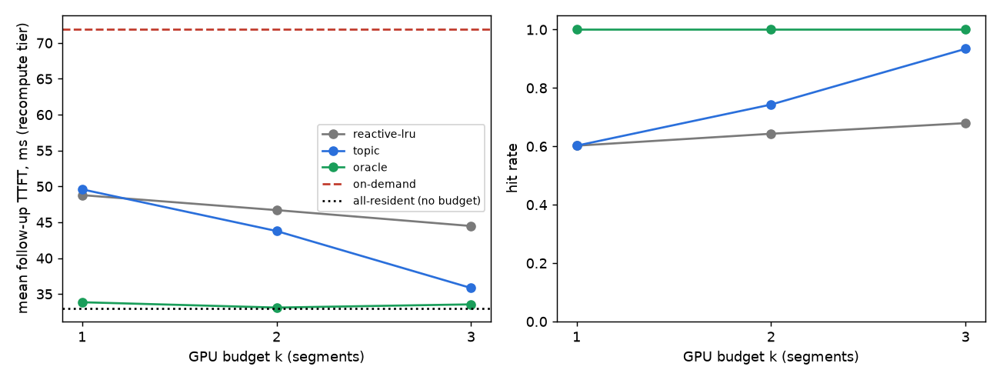

# Concept-Level Speculative Prefetch

**Question:** in multi-turn dialogue, does pre-warming the representations an *active topic* predicts you'll need
(during the user's think time) cut follow-up latency compared with on-demand loading, without hurting accuracy?

Hypothesis by Rolando Gavrila, drawn from introspection on aphantasia: a persistent latent, query-first addressing,
and eager topic-driven prefetch. Claude is used as the research and coding tool.

Status: **day 1 done: conditional GO** (see [notes/go-no-go.md](notes/go-no-go.md)). Next: test whether real topic transitions are predictable. A null result is a valid outcome and will be reported as one.

## Hypotheses

- **H1:** Pre-warming representations for semantically anticipated sub-queries of the active topic reduces
  follow-up latency against a reactive baseline, with no accuracy loss.
- **H0:** No latency gain, or a gain cancelled out by accuracy loss, wasted prefetch, or memory overhead.

## Design note: why the baseline matters

With plain prefix caching, the topic's KV entries are already resident on the GPU. A follow-up then only prefills
its own ~20 tokens, so prefetch has nothing to save, and a toy run under that baseline would be null by
construction. Prefetch can only pay off when there is a **memory hierarchy**, meaning the context is offloaded,
evicted, compressed, or retrieved between turns. In that setting the topic predictor decides which segments to
load or prefill during the user's idle time. The toy baseline is therefore *on-demand reload*, not *prefix caching*.

## Metrics (locked before any run)

| Metric | Definition |
|---|---|
| Follow-up TTFT | time to first token on follow-up turns, ms (median over N runs, after warm-up) |
| Accuracy | task score, same scorer for both arms |
| Prefetch hit rate | share of follow-ups whose needed segment was already warm |
| Wasted prefetch | share of warmed segments never used |
| Memory overhead | peak extra memory vs baseline, MB |

**Success threshold (draft, to be locked in step 2):** ≥15% lower median follow-up TTFT, accuracy within 1 point,
hit rate > 50%.

## Plan

1. Novelty check (arXiv, Semantic Scholar, ICML/NeurIPS/ICLR/ACL 2025–26). Verdict: novel / partially covered / taken.
2. Lock the design: model, task, baseline, threshold.
3. Toy experiment: small open model, synthetic entity with 20 attributes, 5–10 follow-ups.
4. Go/no-go note.

## Log

- **2026-10-04:** Repo created. Changed the toy baseline from prefix caching to on-demand reload (see design note).
  Novelty check started.
- **2026-10-04:** Novelty check done, ~45 papers opened ([notes/novelty.md](notes/novelty.md)).
  Verdict: **partially covered.** Closest prior work: VoiceAgentRAG (topic-predicted text prefetch), EpiCache
  (topic-segmented KV, selected after the query arrives), PerCache (predicted queries → KV, cross-session).
  The open niche is narrow: topic-predicted promotion of conversation KV segments into a bounded GPU budget during
  think time. Required baselines: EpiCache-reactive, reload-all, on-demand, oracle.
- **2026-10-04:** Locked [DESIGN.md](DESIGN.md) (committed before any run). `.venv`: Python 3.12, torch 2.14+cu126,
  transformers 5.18.
- **2026-10-04, sanity check → design deviation (before any policy run).** Qwen2.5-0.5B with fact-sheet KV segments
  prefilled independently at fixed RoPE slots (≈776 tokens, 9.5 MB per segment):

  | Attention scope | Accuracy (n=40) |
  |---|---|
  | only the queried segment | **97.5%** |
  | queried + 1 other segment | 42.5% |
  | queried + 2 others | 35% |
  | all 8 segments | 12.5% |
  | contiguous full context (normal prefill, 6.2k tokens) | 67.5% |

  Segments encoded independently interfere when several are attended at once (the cross-segment problem described
  in CacheBlend). **Change:** GPU residency (budget k) is now separate from attention scope; each follow-up attends
  only to the segment named in the query (EpiCache-style). Consequence: accuracy is the same for every method, so the
  toy tests **latency only**, and threshold 3 is trivially met. Side result: scoped attention beats full context
  on this model (97.5% vs 67.5%).
- **Miss costs measured:** reload from pinned CPU ≈ 0.8 ms; recompute ≈ 79 ms; query TTFT ≈ 50 ms. The reload tier
  cannot reach a 15% gain on a 0.5B model, as predicted.
- **2026-10-04, run 1 discarded:** configurations ran one after another, and the laptop GPU switched clock states
  (~20 vs ~50 ms query TTFT). Two policies that behave identically measured 22.5 vs 49.9 ms. Re-run with all
  policies interleaved per turn (`toy/run_interleaved.py`), with paired comparisons.
- **2026-10-04, toy result → conditional GO** ([notes/go-no-go.md](notes/go-no-go.md)). Recompute tier, k = 2:
  topic prefetch beats reactive LRU by **6.2% mean** (95% CI 2.6–10%), and by 19.4% at k = 3. The locked
  median criterion passes (23.6%), but the median is fragile under the bimodal GPU clock. Reload tier: no gain.
  Wasted prefetch 60–68%. The advantage disappears when conversations don't follow topic links (hit rate 0.71 vs
  0.70), so the next test is whether *real* topic transitions are predictable (TopiOCQA replay, no GPU needed).

- **2026-10-04, H2 locked → novelty: partially covered; the combination appears novel** (see notes/novelty.md).
- **2026-10-04, H2 on the user's own Claude Code logs (run locally by the user; aggregates only):** 5 usable
  sessions, 1,018 turns. Test split (4 sessions, 1,595 needed-file events), hit@4:

  | recency | conversation | environment | graded |
  |---|---|---|---|
  | 10.5% | 0.3% | 6.1% | 11.0% |

  **Pre-registered criterion 1 fails** (+0.5 pt vs a required +10). Criterion 2 passes (+10.8 pt).
  Caveats: the dev split was 1 session with 10 events and 0 hits for every method, so fitting was degenerate and
  graded weights were arbitrary (they collapsed to recency-like). 56% of needed files never appeared in any earlier
  cue (reachable ceiling 44%). Next: an in-sample upper bound (`--upper-bound`) to check whether the null holds
  even under tuning that favours H2.

## Reproduce

```bash
py -3.12 -m venv .venv
.venv/Scripts/python -m pip install torch --index-url https://download.pytorch.org/whl/cu126
.venv/Scripts/python -m pip install transformers accelerate numpy pandas matplotlib
.venv/Scripts/python toy/run.py              # hit-rate sweep + accuracy check (its sequential timings are discarded)
.venv/Scripts/python toy/run_interleaved.py  # paired latency measurement
.venv/Scripts/python toy/analyze.py
```


